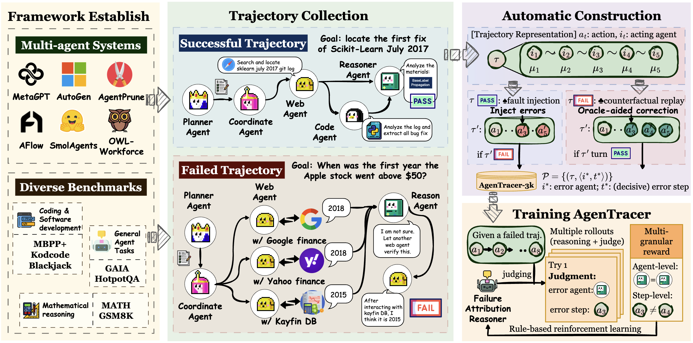

# AgenTracer: Who Is Inducing Failure in the LLM Agentic Systems?




## 👋 Introduction

**AgenTracer** provides comprehensive tools for generating and evaluating training data that identifies **"Who"** (which agent/component) made mistakes and **"When"** (at which step) errors occurred in LLM agentic systems.

This codebase provides a minimal working example where AgenTracer is applied to MetaGPT for data curation.

## 🌎 Setup

### Prerequisites

- Python 3.8+ (recommended: Python 3.11)
- Node.js and pnpm (required for MetaGPT)
- API keys for the services you plan to use


### Environment Setup

```bash
# Create MetaGPT environment
conda create -n metagpt python=3.11
conda activate metagpt

# Navigate to MetaGPT directory
cd MetaGPT

# Install dependencies
pip install -r requirements.txt
pip install -e .

# Install Node.js dependencies
npm install -g pnpm

# Initialize MetaGPT configuration
metagpt --init-config
```

### 🔑 Configuration

#### MetaGPT Configuration

Edit `~/.metagpt/config2.yaml` with your API keys:
```yaml
llm:
  api_type: "openai"
  model: "gpt-4-turbo"
  base_url: "https://api.openai.com/v1"
  api_key: "YOUR_OPENAI_API_KEY"
```


#### Evaluation Framework Configuration

Edit `eval_whp_when/config/eval.yaml` with your model configuration:
```yaml
model: qwen/qwen3-8b  # Your model name
temperature: 0.0      # Temperature for generation
n: 1                  # Number of samples per prediction
```

## 🚀 Quick Start

### MetaGPT Framework

```bash
# Activate MetaGPT environment
conda activate metagpt

# Navigate to framework directory
cd MetaGPT/Who_When_Data_Pipeline/universal_framework

# Run with basic configuration
python universal_framework.py \
  --dataset kodcode \
  --work_dir /path/to/MetaGPT \
  --output /path/to/output \
  --max_rounds 3 \
  --max_tasks 10
```


### Evaluation Framework

The evaluation framework provides comprehensive assessment of "Who" and "When" error detection capabilities:

```bash
# Navigate to evaluation directory
cd eval_whp_when

# Run evaluation on coding dataset
python eval_coding_and_math_data/run_eval_coding.py

# Run evaluation on math dataset
python eval_coding_and_math_data/run_eval_math.py

# Run evaluation on custom dataset
python eval.py \
  --dataset Kevin355/Who_and_When \
  --subset Hand-Crafted \
  --split train \
  --output results/ \
  --concurrency 10 \
  --groundtruth \
  --skip-existing
```


## 🫡 Citation

If you find this repository helpful, a citation would be greatly appreciated:

```bibtex
@misc{zhang2025agentracer,
      title={AgenTracer: Who Is Inducing Failure in the LLM Agentic Systems?}, 
      author={Guibin Zhang and Junhao Wang and Junjie Chen and Wangchunshu Zhou and Kun Wang and Shuicheng Yan},
      year={2025},
      eprint={2509.03312},
      archivePrefix={arXiv},
      primaryClass={cs.CL},
      url={https://arxiv.org/abs/2509.03312}, 
}
```
